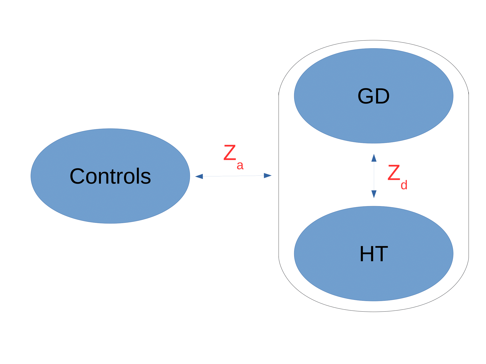
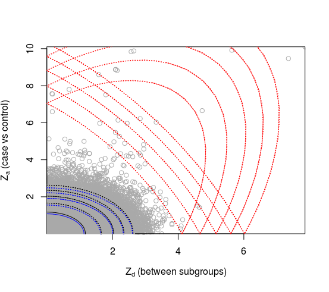

```{r setup, include = FALSE}
knitr::opts_chunk$set(
  collapse = TRUE,
  comment = "#>"
)
```

## Overview

This vignette details the general use of the `Subtest` package for the characterisation of heterogeneity in disease genetics. It makes use of a dataset of autoimmune thyroid disease (ATD) cases, subcategorised into Grave's disease (GD) and Hashimoto's thyroiditis (HT). Some repetitive steps in the procedure are truncated for brevity.


## Data

The procedure begins by generating summary statistics for case-control and within-case comparisons in the disease of interest. In the current example, this comprises a comparison of all ATD cases against controls to generate statistics $Z_a$, and a comparison of GD against HT to generate statistics $Z_d$ (figure 1). 

 <figure>
  <center>
  
  <figcaption>Figure 1. Z-scores for ATD.</figcaption>
  <center>
</figure> 

In PLINK, a phenotype file `pheno.txt` (with the BED file `gtypes.bed`) of the following form would be used. The column `AC` specifies ATD/control status with controls coded as 0 and cases coded as 1. The column `GH` specifies subtype status, with GD coded as 0 and HT coded as 1 (with controls coded as -9):

`pheno.txt`

FID    IID    AC     GH
---    ---    ---    ---
F1     1001   0      -9
F2     1002   0      -9
...    ...    ...    ...
F501   1501   1      1
F502   1502   1      1
...    ...    ...    ...
F1001  2001   1      2
F1002  2002   1      2
---    ---    ---    ---

we would compute p-values corresponding to $Z_d$ using the script

`plink --bfile gtypes --pheno pheno.txt --assoc --pheno-name GH  --adjust --out as3`

and compute p-values corresponding to $Z_a$ using the script

`plink --bfile gtypes --pheno pheno.txt --assoc --pheno-name AC  --adjust --out as3`

See `http://zzz.bwh.harvard.edu/plink/` for more details.

Summary statistics in the form of p-values can also be obtained using the R package `snpStats`. Covariates can be included in the computation of p-values as needed. Z-scores can be computed from p-values using the normal quantile function; for a set of p-values stored in the variable `p`, corresponding absolute z-scores `z` can be obtained using eg `z = -qnorm(p/2)`. Signed z-scores may be useful in visualisation but are not necessary for the main procedure.

In order to manage effects from LD between variants, each SNP needs to be weighted for the subsequent analyses. This is done using the LDAK procedure, which is detailed at `http://dougspeed.com/ldak/`. The procedure is explained in detail on the LDAK page. In brief, for a `.bed` file `snps.bed`, the LDAK procedure involves running the three functions (in bash):

```
export outdir=./LDAK # directory to store output in
export bedfile=snps # .bed file

# assume that LDAK software is installed in current directory
./ldak --cut-weights $outdir/weights --bfile $bedfile # subdivide variants

export nn=`tail -1 < $outdir/weights/section_details.txt |cut -d" " -f1` # number of subdivisions
for j in $(seq 1 $nn);
do
 export i=$j
 ./ldak --calc-weights $outdir/weights --bfile $bedfile --section $i # compute weights
done 

./ldak --join-weights $outdir/weights # concatenate weight files together
```

Weights for each SNP need to be imported into R. In the above example, after which SNP weights will be in the file `./weights/weightsALL`, weights can be imported using:

```
weight_tab=read.table("./weights/weightsALL",stringsAsFactors=F,header=F)
weights=weight_tab[,1]; names(weights)=weight_tab[,5]
```

Genotype matrices cannot be provided in this package due to privacy considerations, but example $Z_a$ and $Z_d$ scores are included in the package in the variable `z_atd`. Corresponding LDAK weights are stored in the variable `weights_atd`. The MHC (HLA) region has been removed from this dataset, as is standard in autoimmune genomics.

## Fitting models

Load the package using

```
load(Subtest)
```


Models are fitted to $Z_d$ and $Z_a$ scores under the null and full hypothesis $H_0$ and $H_1$. To fit models, use the function `fit.3g`. The parameter `pars` is the set of parameters at which to start the fitting algorithm. It is generally a good idea to start the algorithm at a range of different values of `pars` (which may be chosen using the function `pars_start`) in order to avoid reaching local rather than global likelihood maxima. The model for which the attribute `plhood` is greatest should be chosen as the optimal model. Model parameters, PLR value and p-values will differ slightly in this vignette from the value reported in the paper due random variation. An example of the fitting procedure is as follows:

```
# Sample parameter space for parameter sets to start at
pars_options_full=pars_start(z_atd,weights=weights_atd) 
pars_options_null=pars_start(z_atd,weights=weights_atd,H=0) 


# Fit models
best_obj_sofar_full=-Inf # best value of objective function so far
best_obj_sofar_null=-Inf # best value of objective function so far

for (i in 1:nrow(pars_options)) {
 pars_start_full=pars_options_full[i,]
 pars_start_null=pars_options_null[i,]
 
 # Full model (H1)
 atd_full_i=fit.3g(z_atd,weights=weights_atd,pars=pars_start_full,fit_null=FALSE)

 # Null model (H0)
 atd_null_i=fit.3g(z_atd,weights=weights_atd,pars=pars_start_null,fit_null=TRUE)

 if (atd_full_i$logl > best_obj_sofar_full) {
  atd_full=atd_full_i
  best_obj_sofar_full=atd_full_i$logl
 }

 if (atd_null_i$logl > best_obj_sofar_null) {
  atd_null=atd_null_i
  best_obj_sofar_null=atd_null_i$logl
 }

}
```

To see details of the fitted model:

```
summary(atd_full)
```

The model can be visualised. Points corresponding to variants are shown in grey. Dotted lines show contours of fitted distributions corresponding to categories 1 (black), 2 (blue) and 3 (red).

```
plot(atd_full)
```

 <figure>
  <center>
  
  <center>
</figure> 


## Computation of PLR statistic

The PLR is computed as per the publication by comparing pseudolikelihoods and subtracting a correcting factor:

```
plr_atd = atd_full$logl- atd_null$logl - (atd_full$logl_a - atd_null$logl_a)
```

## Estimation of null distribution

In order to perform a hypothesis test against $H_0$, we determine a rejection region by estimating the distribution of a statistic $cPLR$ such that (heuristically) $Pr(cPLR>x) \leq Pr(PLR>x|H_0)$. 

This is achieved by repeatedly producing new sets of test statistics $(Z_d',Z_a)$ where values $Z_d'$ are computed in the same way as $Z_d$ but with subtype labels randomly ordered, and values $Z_a$ remain the same as above. On each of these new sets, we compute the $cPLR$.  

Firstly, the distribution of $Z_a$ is approximated by a spike-and-tail parametrisation:

\begin{equation}
Z_a \sim \begin{cases} N(0,1) & \textrm{prob}= 1-\pi_1 \\ N(0,\sigma_1^2) & \textrm{prob}=\pi_1 \end{cases}
\end{equation}

This is achieved using the function `fit.em`, storing the values $\pi_1$ (`pi1`) and $\sigma_1$ (`s1`) for use in subsequent analysis:

```
za_dist=fit.2g(z_atd[,"z_a"],weights=weights_atd)
s1=za_dist$pars[2]
pi1=1-za_dist$pars[1]; 
```

The $cPLR$ is computed from fitted models with $\pi_1$ and $\sigma_1$ fixed at these values:

```
pi0=1-(2*pi1)
pars_start_rand=c(pi0,pi1,1,s1,1,0)
```

An example of $(Z_d',Z_a)$ scores with $Z_d'$ generated from random reassignment of GD and HT labels is stored in the variable `z_atd_rand`. The `cPLR` is computed in the following way. Because the `fit.cond` function optimises over a smaller number of variables and does not use an E-M algorithm (it uses R's `optim` function) it does not need to be re-ran at a range of starting values.

```
rand_full=fit.cond(z_atd_rand,weights=weights_atd,pars=pars_start_rand,fit_null=FALSE)
rand_null=fit.cond(z_atd_rand,weights=weights_atd,pars=pars_start_rand,fit_null=TRUE)
```

Simulations for which the model fails to converge (in which case the global parameter `conv` will be nonzero), or converges to a value on or very near the boundary of the parameter space (which can be identified as grossly outlying values of fitted parameters) should be discarded.

It is convenient to store results from simulations as summary vectors, for instance:

```
seed=0 # 
summary_vector=c(rand_null$logl,rand_full$logl,
                 rand_null$pars,rand_full$pars)
```

Results from 1000 simulations of this type are stored in the matrix `atd_sim_results` (preferably, >5000 simulations should be used; 1000 are included for brevity here).

## Hypothesis testing

Heuristically, the distribution of the $cPLR$ is expected to be close to a mixture-$\chi^2$. A rejection region can either be constructed based on the empirical CDF of observed cPLR values or by estimating the underlying distribution. The function `p_value` can be used to estimate p-values. By default, it uses the empirical CDF where possible, and extrapolates using the mixture-$\chi^2$ when needed. The function `mixchipars` returns the values of the fitted mixture-$\chi^2$ distribution. 

```
# Compute cPLR values (no adjustment for Za is needed when computing cPLR)
cplr_vals=atd_sim_results[,2]-atd_sim_results[,1] 
mix_pars=mixchipars(cplr_vals) # parameters of mixture-chi squared distribution

# P-value against H0
p_atd=p_value(plr_atd,cplr_vals)
```

The p-value is against the null hypothesis that 'the variants associated with GH/HT status are independent of the variants associated with ATD/control status'.


## Post-hoc single SNP analyses

After testing the main (polygenic) hypothesis, it is useful to consider which SNPs differentiate subgroups (GD/HT in this case). We recommend the use of the Bayesian conditional false discovery rate to do this, which tests each against the null hypothesis that the SNP is not associated with subgroup status. To compute the test statistics for each SNP, use:

```
teststats=cfdr(z_atd)
```

For an approximate bound on the FDR if the null is rejected whenever `teststat<alpha`, use

```
alpha=0.01
fdr_bound=c2a(z_atd,alpha,pars0=atd_null$pars)
```